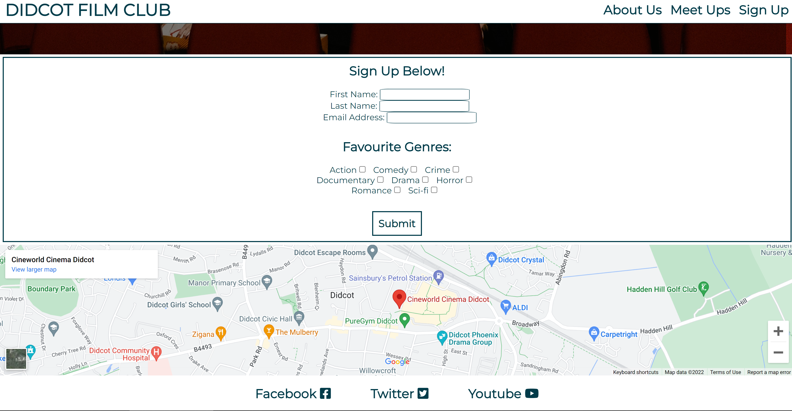
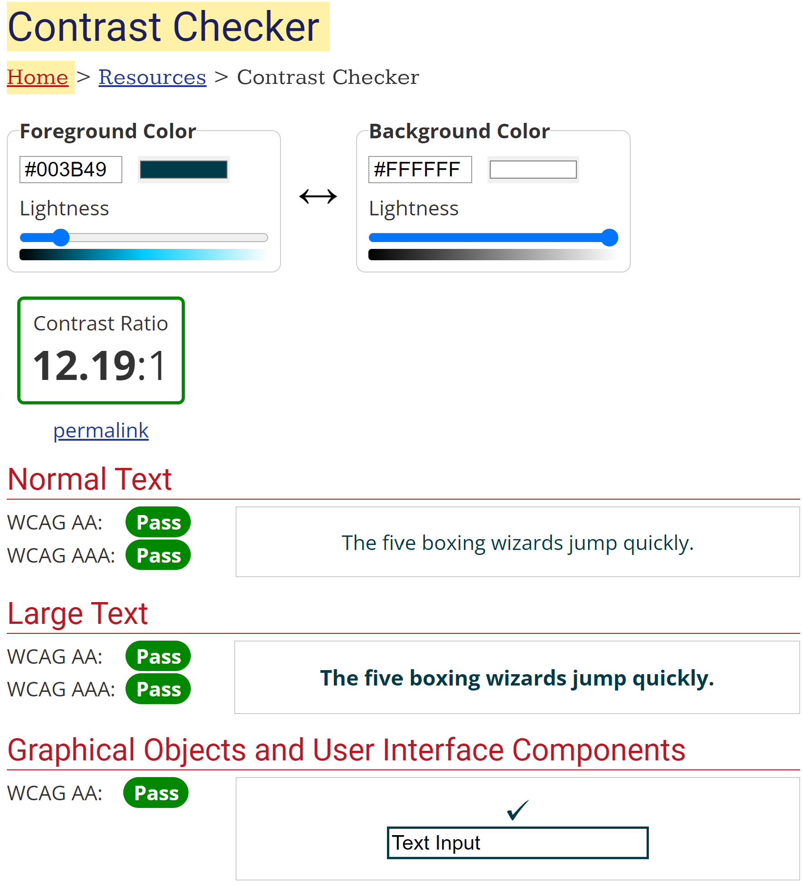
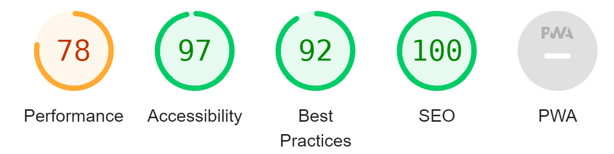
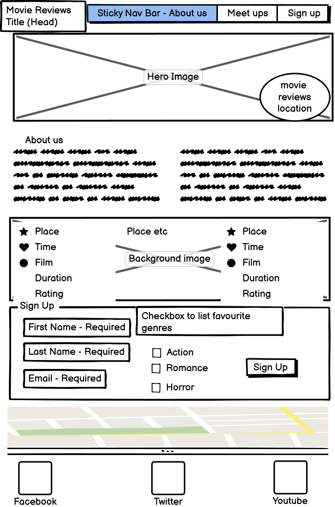
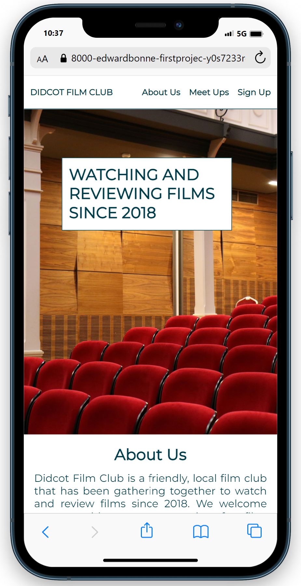
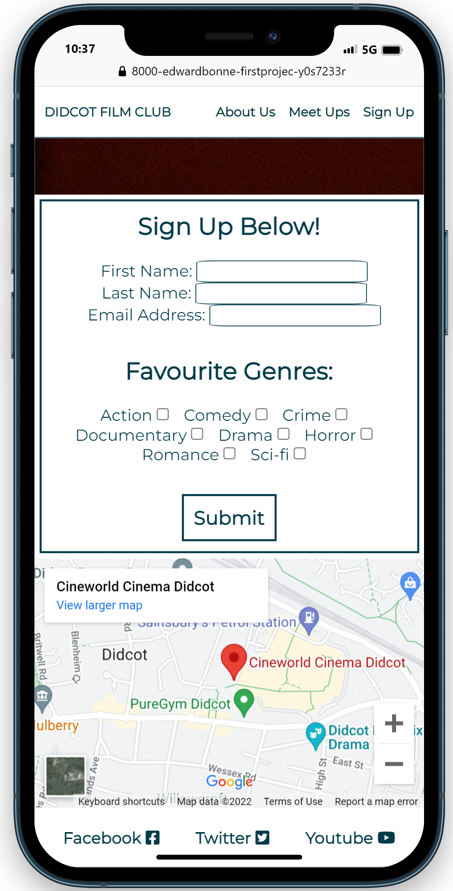
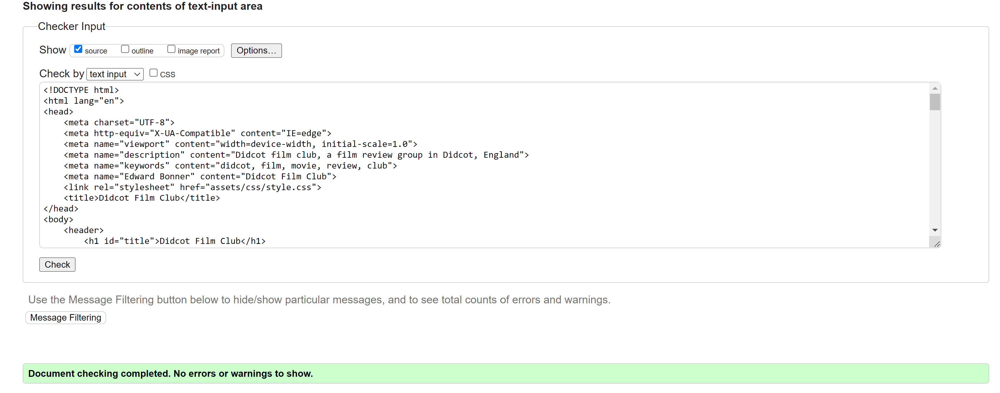
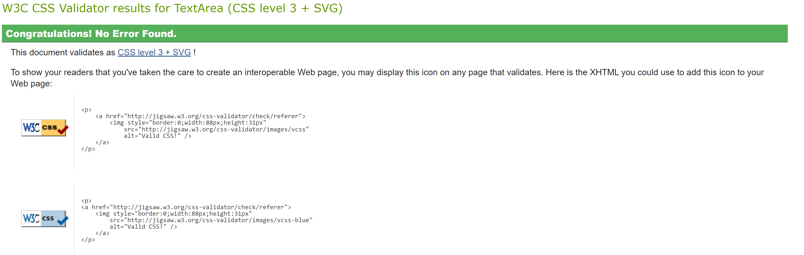

# Didcot Film Club 

## Purpose of the Project
The Didcot Film Club website is a site that hopes to encourage local users to meet regularly to watch and review films. The site will be targeted towards film-goers looking to socialise and meet other similarly interested people. The site will be useful for current and prospective members to see when the next meeting is and will allow new users to be added to a mailing list. 

## Existing Features and User Stories
### Navigation Bar
 - The fully responsive navigation bar links to the main sections of the website and stays in place at the top of the site for ease of navigation.
 - This will allow the user to easily navigate the website on any device.
 - The navigation bar also features the title, making it obvious which location this site is applicable to.

### The Landing Page Image
 - The Hero Image includes a photograph with text overlay so the user can see who this site would be applicable to.

### About Us Section
 - The About Us section allows the user to get a feel for the club itself and also mentions the benefits of joining. 
 - The user should see the value of signing up to Didcot Film Club, encouraging them to come to a meeting.

 

### Meet Ups Section
 - The Meet Ups section will allow the user to see when and where the meetups will happen, what film is on and the rating given by the members of the club.
 - This section will be updated over time to give users up to date information.

 

### Sign Up Section
 - This section allows a user to sign on to the club's newsletter and opens a line of communication. 
 - The information required is minimal and the form is responsive to a users interaction.
 - If a user makes a mistake by leaving a required field empty or missing the "@" in their email the form will not submit and a pormpt will appear telling the user why.
 - When a user has signed up a confirmation page opens in a new window.

### Googlemaps
 - This section shows the user where the next meeting point will take place and it's value lies in being extremely quick and easy for the user to use.

### Footer
 - The footer contains links to relevant social media. The links will open in a new tab for ease of use. 
 - The footer is valuable to the user as it makes it easy to and encourages keeping in touch and staying informed with social media.

 

## Future Features
 - In the future videos will be linked below the Meet Ups section showing trailers for the films the user will be going to see. These videos will autoplay muted for a positive user experience.

## Typography and Color Scheme
 - The priority when picking typography and color scheme was accessability as shown by the tools below. 
 - The contrasting colors #FFFFFF (background) and #003B49 (font & borders) used on the website are extremely easy to see and easily pass the WCAG tests as per WebAIM: Contrast Checker
 - The Montserrat font was chosen for high readability and accessability.
 - Finally the developer tool lighthouse was used to test the website 

## Wireframes
 - A wireframe of the project was planned using Balsamiq.
 
Having a rough plan of the website while building it is immensely useful and I have not deviated much from this plan. From an aesthetic perspective, the bubble in the hero image was better in the top left because of my chosen image. Similarly the sign-up page is more narrow and long. 

## Testing
 - As above, the website has passed many accessability and contrast tests.
 - Using the Chrome Mobile Simulator tool the website was tested on different screen sizes. It is very responsive and there are no errors due to resizing.  .
 - Every internal link has been tested and all work as expected
 - All of my html returns no errors in the W3C validator
 - Similarly JIGSAW returned no errors in my css
 
 
 - Additionally the code has been tested in Firefox and Internet edge and performs the same there. 

 ### Bug Testing
 - Initially the footer was set to 100% width and had padding stretching out beyond the rest of the webpage. The footer was found to be the cause by using chrome developer tools to examine each element and highlight their shapes. The padding was then removed.
 - Similarly the header initially occupied it's size over the top of the hero image rather than resting on it. This bug was solved when I found useful (and credited) code online. 

## Deployment
### Gitpod
 - Gitpod contains all of the building blocks and commits of the site. 

### Github Pages
 - The finished site was deployed to Github pages
 - In the github repository, navigate to setttings
 - From the source menu select the master or root branch
 - Once selected the page will be refreshed and the site deployed
 - The live link can be found here: 

## Credits
### Content
 - The map above the footer is from Google Maps.
 - The Montserrat font from Google fonts.
 - The icons in the footer were taken from Font Awesome.
 - From the following link I used the code "html {scroll-padding-top: 50px;}" to fix an issue with the header overlapping content. https://css-tricks.com/fixed-headers-on-page-links-and-overlapping-content-oh-my/0
### Media 
 - The images used directly on the site are both from Pexels, a free open-source image site. (Landing page and Meet Ups background image)